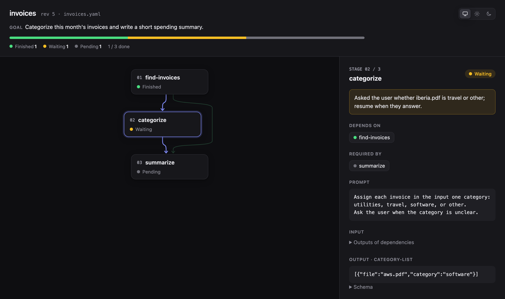

# Durable Flow

An agent skill for complex multi-stage processes, such as sorting a month of
invoices or turning a pile of documents into notes. Run in one long agent
session, such a process gets expensive and fragile: the context keeps growing,
the model makes more mistakes, and an interruption loses the progress. Durable
Flow runs the process one stage at a time and keeps its state in a JSON or YAML
flow file.

- Agent instructions: [`SKILL.md`](../../skills/durable-flow/SKILL.md)
- Starter flows: [`example.json`](../../skills/durable-flow/references/example.json),
  [`example.yaml`](../../skills/durable-flow/references/example.yaml)
- A full run with a pause and a resume: [`lifecycle.md`](../../skills/durable-flow/references/lifecycle.md)

## Goals

- Lower the cost of complex multi-stage processes.
- Improve their quality and repeatability.

## How it works

The skill is a [`SKILL.md`](../../skills/durable-flow/SKILL.md) plus a few
scripts, so it runs in any harness that supports skills: Claude Code, Codex,
OpenCode, Pi Agent, and others.

- **One stage at a time.** The flow file splits the process into atomic
  stages. The main agent acts as an orchestrator: it starts a stage, hands it
  to a subagent, and records the result. The subagent sees only the flow goal,
  the stage prompt, and the stage input (the outputs of the stages it depends
  on). The other stages stay hidden, so the prompt stays small: the model has
  less room to hallucinate, and a smaller, cheaper model can handle the stage.
- **Scripts instead of file edits.** The agent reads and changes the flow only
  through the scripts, never by opening the file. The scripts show only the
  active stage in full, and every write passes the flow revision the agent
  last saw, so a stale agent cannot overwrite newer progress.
- **Structured outputs.** A stage can declare an output schema, similar to
  structured output in LLM APIs. The stage finishes only when its output
  matches the schema, so the next stages get the data they expect.
- **Durable state.** The flow file holds the state of the whole run, so a run
  can stop at any point and resume in another session. A stage can also pause
  on purpose to wait for an outside event, such as a person's approval or a
  pull request review.

These rules are instructions, not guarantees: the skill relies on the agent
following them. A harness with an extension API, such as Pi Agent, could
enforce them instead (see [Future enhancements](#future-enhancements)).

## Installation

```bash
npx skills add https://github.com/zzzevaka/agent-skills --skill durable-flow
```

## Usage

The examples use OpenCode. In other harnesses, make the same request the way
that harness invokes skills.

### Run the whole flow

```bash
opencode run "@durable-flow run path/to/flow.yaml"
```

### Run one stage and stop

```bash
opencode run "@durable-flow run only next stage and stop path/to/flow.yaml"
```

### Visualize the flow

```bash
opencode run "@durable-flow render path/to/flow.yaml"
```



### Validate a flow file

After writing a flow by hand, check it without an agent:

```bash
python3 skills/durable-flow/scripts/validate.py -p path/to/flow.yaml
```

The script lists every problem it finds, including unknown keys such as a
misspelled `output_shema`, and exits with `1`; a valid flow exits with `0`.

## Example: categorize invoices

A flow that sorts a month of invoices and summarizes the spending:

```yaml
name: invoices
goal: |
  Categorize this month's invoices and write
  a short spending summary.

schemas:
  invoice-list:
    type: array
    items:
      type: object
      properties:
        file:
          type: str
        vendor:
          type: str
        amount:
          type: float
  category-list:
    type: array
    items:
      type: object
      properties:
        file:
          type: str
        category:
          type: str

stages:
  - name: find-invoices
    prompt: |
      List the PDF invoices in ~/Documents/Invoices/2026-09
      with their vendor and amount.
    output_schema: invoice-list

  - name: categorize
    prompt: |
      Assign each invoice in the input one category:
        - utilities
        - travel
        - software
        - or other
      Ask the user when the category is unclear.
    depends_on: [find-invoices]
    output_schema: category-list

  - name: summarize
    prompt: |
      Write a short spending summary with a total per category.
    depends_on: [find-invoices, categorize]
```

## Background

I wanted to automate parts of my routine: sorting documents, invoices, and
important messages from different sources. For another project, I had to
convert a large set of documents into notes for my Obsidian knowledge base.

At first, I used frontier models from OpenAI and Anthropic in their own
harnesses, Claude Cowork and Codex. This approach had two problems:

1. Cost. At a large volume of tasks, cheap subscriptions are no longer enough.
2. Privacy. Some workflows process personal documents that I'd rather not show
   to LLM providers.

Next, I tried Pi Agent and OpenCode with local models that fit on my MacBook
Pro M4 Pro with 24 GB of unified memory. gpt-oss-20b did best, but still not
well enough: it often made mistakes, and the more complex the workflow, the
less likely it was to finish. The context was too large. So I split the work
into stages and gave the model only the context each stage needs.

## Future enhancements

- **Parallelism.** Stage dependencies already form a directed acyclic graph
  (DAG), so stages whose inputs are ready could run in parallel when the
  harness supports it. Today, stages run one at a time.
- **Execution log.** `set_output` keeps only the latest intermediate output. A
  log of checkpoints would let a long stage resume from any saved point.
- **Harness integration.** Enforce the rules through the harness, for example
  with a Pi Agent extension, rather than as instructions to the agent.
